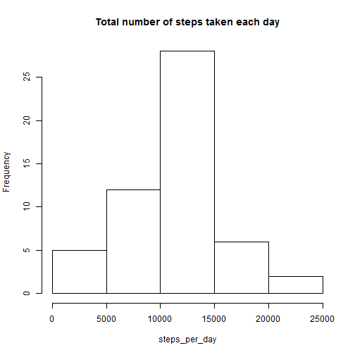
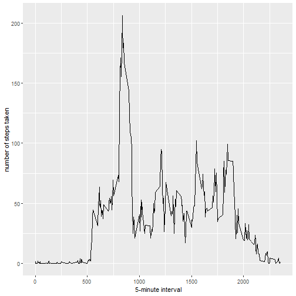
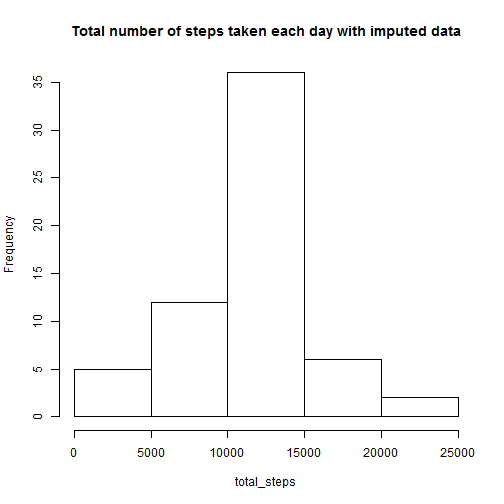
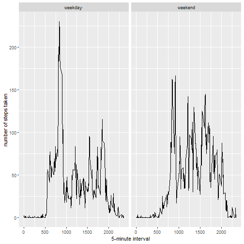

## Loading and preprocessing the data


```r
unzip("repdata_data_activity.zip")
activity <- read.csv("activity.csv", na.strings = "NA")
head(activity)
```

```
##   steps       date interval
## 1    NA 2012-10-01        0
## 2    NA 2012-10-01        5
## 3    NA 2012-10-01       10
## 4    NA 2012-10-01       15
## 5    NA 2012-10-01       20
## 6    NA 2012-10-01       25
```


## What is mean total number of steps taken per day?

1. Total number of steps taken per day

```r
## Group the data by day and compute the sum on each steps
library(dplyr)
steps_taken_per_day <- group_by(activity, date)%>% summarize(steps_per_day = sum(steps))
```

2. Histogram of the total number of steps taken each day

```r
## Plotting
with(steps_taken_per_day, hist(steps_per_day, main = "Total number of steps taken each day"))
```



3. **mean** and **median** total number of steps taken per day

```r
mean <- mean(steps_taken_per_day$steps_per_day, na.rm = TRUE)
median <- median(steps_taken_per_day$steps_per_day, na.rm = TRUE)
```

The mean and median of total number of steps taken per day are respectively 1.0766189 &times; 10<sup>4</sup> and 10765. They are already very close to one another, either could be a good measurement of central tendency.


## What is the average daily activity pattern?

1. Time series plot of the 5-minute interval and the average number of steps taken, averaged across all days.


```r
# Calculate interval means
interval_mean <- summarize(group_by(activity, interval), steps= mean(steps, na.rm=TRUE))
head(interval_mean)
```

```
## # A tibble: 6 x 2
##   interval  steps
##      <int>  <dbl>
## 1        0 1.72  
## 2        5 0.340 
## 3       10 0.132 
## 4       15 0.151 
## 5       20 0.0755
## 6       25 2.09
```


```r
library(ggplot2)
qplot(interval, steps, data = interval_mean, geom = "line", xlab= " 5-minute interval", ylab = "number of steps taken")
```



2. 5-minute interval, on average across all the days in the dataset, which contains the maximum number of steps


```r
maxint <- interval_mean$interval[which.max(interval_mean$steps)]
```
The 5-minute interval, on average across all the days in the dataset, which contains the maximum number of steps is 835


## Imputing missing values

1. Total number of missing values in the dataset 


```r
total_miss_value <- sum(is.na(activity$steps))
```

There are 2304 missing values in this dataset.

2. Strategy for filling in all of the missing values in the dataset and new dataset


```r
activity_imp <- activity
activity_imp$steps <- replace(activity_imp$steps, is.na(activity_imp$steps), interval_mean$steps)
head(activity_imp)
```

```
##       steps       date interval
## 1 1.7169811 2012-10-01        0
## 2 0.3396226 2012-10-01        5
## 3 0.1320755 2012-10-01       10
## 4 0.1509434 2012-10-01       15
## 5 0.0754717 2012-10-01       20
## 6 2.0943396 2012-10-01       25
```

3. Histogram of the total number of steps taken each day


```r
## Group the data by day and compute the sum on each steps
library(dplyr)
steps_taken_per_day_imputed <- summarize(group_by(activity_imp, date), total_steps = sum(steps))
## Plotting
with(steps_taken_per_day_imputed, hist(total_steps, main = "Total number of steps taken each day with imputed data"))
```


4. New **mean** and **median** total number of steps taken per day

```r
mean1 <- mean(steps_taken_per_day_imputed$total_steps, na.rm = TRUE)
median1 <- median(steps_taken_per_day_imputed$total_steps, na.rm = TRUE)
```

The new mean and median of total number of steps taken per day are respectively 1.0766189 &times; 10<sup>4</sup> and 1.0766189 &times; 10<sup>4</sup>.

## Are there differences in activity patterns between weekdays and weekends?

1. New factor variable in the dataset with two levels -- "weekday" and "weekend".


```r
## Create a new column of weekdays in the dataset
activity_imp$weekdays <- weekdays(as.Date(activity_imp$date, format = "%Y-%m-%d"))
activity_imp$weekdays <- ifelse(activity_imp$weekday %in% c("samedi", "dimanche"), "weekend", "weekday")
head(activity_imp)
```

```
##       steps       date interval weekdays
## 1 1.7169811 2012-10-01        0  weekday
## 2 0.3396226 2012-10-01        5  weekday
## 3 0.1320755 2012-10-01       10  weekday
## 4 0.1509434 2012-10-01       15  weekday
## 5 0.0754717 2012-10-01       20  weekday
## 6 2.0943396 2012-10-01       25  weekday
```


```r
# Calculate interval means
interval_imp_mean <- summarize(group_by(activity_imp, interval, weekdays), steps= mean(steps))
head(interval_imp_mean)
```

```
## # A tibble: 6 x 3
## # Groups:   interval [3]
##   interval weekdays  steps
##      <int> <chr>     <dbl>
## 1        0 weekday  2.25  
## 2        0 weekend  0.215 
## 3        5 weekday  0.445 
## 4        5 weekend  0.0425
## 5       10 weekday  0.173 
## 6       10 weekend  0.0165
```

2. Time series plot of the 5-minute interval and the average number of steps taken, averaged across all days.


```r
library(ggplot2)
## png(filename="plot4.png",width=480,height=480)
qplot(interval, steps, data = interval_imp_mean, geom = "line", facets = .~ weekdays, xlab= " 5-minute interval", ylab = "number of steps taken")
```



```r
## dev.off()
```


